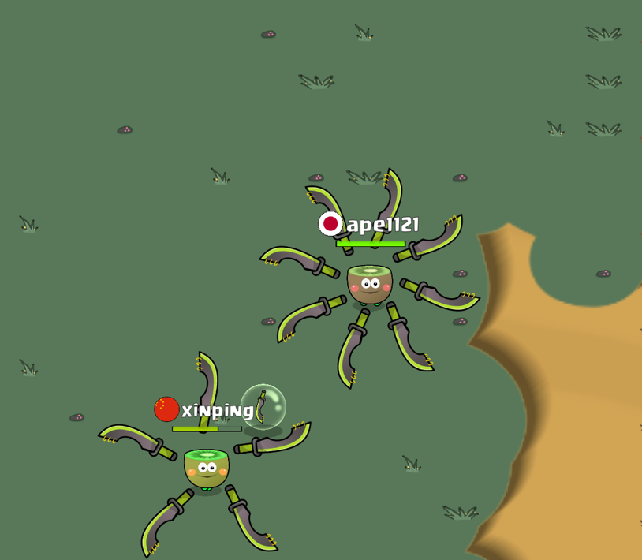

# Kiwi Brawlers Playable Ad

A Unity-based game implementation featuring sword combat mechanics and AI opponents, that is aimed to be deployed as a playable ad for app stores or other services, using Unity Playworks (formerly Luna) plugin.

## Project Overview

The game is a multiplayer-style combat game where players can:
- Pick up swords that spawn randomly on the map
- Engage in sword combat with AI opponents
- Win by defeating all other characters
- Navigate through procedurally generated terrain (grass and stone tiles)

## Technical Details

### Built With
- Unity 2022.3.51 (LTS)
- C# for gameplay scripting

### Key Features
- Core sword combat mechanics
- AI opponents with strategic behavior
- Random sword spawning system
- Health system (3 hits before defeat)
- Procedurally generated background tiles
- End game state handling (Call to Action for Ads)

### Game Mechanics
- Four characters total (1 player + 3 AI opponents)
- Sword spawning at random intervals
- Sword clash mechanics (both swords destroyed on collision)
- Basic health system
- Intuitive controls for movement and combat (Touchstick)

### AI Behavior
- Pathfinding towards nearest sword
- Combat engagement logic
- Obstacle avoidance
- Strategic decision making

## Setup Instructions

1. Clone the repository
2. Open in Unity 2022.3.51 (LTS)
3. Note: Luna Playable Plugin is not included in this repository and needs to be installed separately if you want to build for playable ads
4. Open the main scene in Assets/Scenes
5. Press Play to test the game

## Development Notes

- The background uses a tile-based system with random placement of grass and stone tiles
- Enemy AI is balanced to provide a challenging but fair experience

## Additional Requirements

To build this project as a playable ad, you'll need:
- Luna Playable Plugin (not included in this repository)
- Luna Playable account setup
